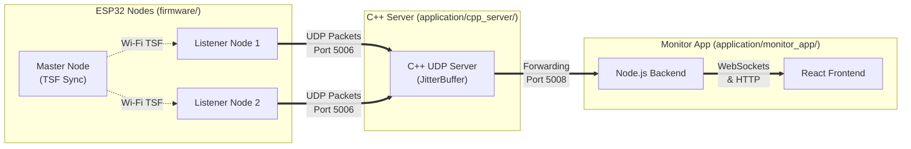

# Locustracer

Locustracer is a Time Difference of Arrival (TDOA) acoustic tracking system. The project features a distributed hardware-software architecture designed to precisely synchronize audio streams across multiple devices and accurately estimate the location of acoustic sources.

## System Overview

Locustracer consists of several core components working in tandem:

- **Master/Listener ESP32 Nodes (`firmware/`)**: ESP32 microcontrollers that capture audio. A master node coordinates the synchronization via Wi-Fi Time Synchronization Function (TSF), while listener nodes transmit timestamped UDP audio packets.
- **C++ UDP Server (`application/cpp_server/`)**: A high-performance, real-time networking component. It implements a JitterBuffer that aligns incoming audio streams perfectly in time, intelligently injecting silence for any dropped packets to maintain phase alignment.
- **Monitor App (`application/monitor_app/`)**: A Node.js backend and React frontend. It provides a unified API and WebSocket stream server to visualize real-time telemetry, track system statistics (bandwidth, jitter, packet loss), and render high-speed audio waveforms and TSF drift.

For a comprehensive view of the system design, please see the [Architecture Overview](docs/ARCHITECTURE.md) and [API Documentation](docs/API.md). Hardware specifics and firmware configuration can be found in the [Firmware Directory](firmware/).

## Agentic Workflow

This project is actively maintained and evolved using an Agentic Workflow. Development tasks are delegated to specialized AI subagents, ensuring modularity, code quality, and accurate documentation.

If you are an agent or a human contributor, please familiarize yourself with the following guidelines before making changes:

- **[AGENTS.md](AGENTS.md)**: Defines the roles, responsibilities, and system prompts of the various specialized agents (Firmware Engineer, Systems Engineer, Web Developer, Documentation Agent) contributing to this project.
- **[SKILL.md](SKILL.md)**: Details the capabilities, development lifecycle, and workflow instructions for agents maintaining the codebase.

Following these documents ensures that updates, especially cross-domain handoffs (e.g., updating a UDP packet structure), are consistently documented and effectively communicated across the ecosystem.
