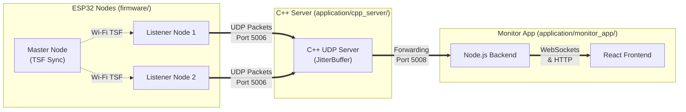

# Locustracer

Locustracer is a Time Difference of Arrival (TDOA) acoustic tracking system. The project features a distributed hardware-software architecture designed to precisely synchronize audio streams across multiple devices and accurately estimate the location of acoustic sources.

## System Overview

Locustracer consists of several core components working in tandem:



- **Master/Listener ESP32 Nodes (`firmware/`)**: ESP32 microcontrollers that capture audio. A master node coordinates the synchronization via Wi-Fi Time Synchronization Function (TSF), while listener nodes transmit timestamped UDP audio packets.
- **C++ UDP Server (`application/cpp_server/`)**: A high-performance, real-time networking component. It implements a JitterBuffer that aligns incoming audio streams perfectly in time, intelligently injecting silence for any dropped packets to maintain phase alignment. It also natively computes the Time Difference of Arrival (TDOA) location utilizing GCC-PHAT cross-correlation and Gauss-Newton optimization.
- **Monitor App (`application/monitor_app/`)**: A Node.js backend and React frontend. It provides a unified API and WebSocket stream server to visualize real-time telemetry, track system statistics (bandwidth, jitter, packet loss), and render high-speed audio waveforms and TSF drift.
- **Digital Twin Simulation (`application/simulations/`)**: A Pyroomacoustics-based environment to simulate the acoustic nodes, hardware clock jitter, and realistic TDOA sound tracking, serving as a virtual drop-in replacement for the physical hardware.

For a comprehensive view of the system design, please see the [Architecture Overview](docs/ARCHITECTURE.md) and [API Documentation](docs/API.md). Hardware specifics and firmware configuration can be found in the [Firmware Directory](firmware/).

## Running the System

You can run the Locustracer software stack (C++ server, Node.js backend, and React frontend) either natively or via Docker.

### Running Natively

To start all services (C++ server, Node.js backend, and React frontend) natively, run:

```bash
./locustracer.sh start
```

To start **only** the React frontend natively, run:

```bash
./locustracer.sh start --only-frontend
```

### Running via Docker

To start the entire system using Docker Compose, run:

```bash
./locustracer.sh start --docker
```

To start **only** the React frontend in a standalone Docker container, run:

```bash
./locustracer.sh start --docker --only-frontend
```

> [!TIP]
> **macOS Docker Enhancements in Script:**
> The `./locustracer.sh` script includes robust helpers for macOS users:
> - **Auto-Detection:** Automatically searches for and utilizes the macOS Docker bundle binary (`/Applications/Docker.app/Contents/Resources/bin/docker`) if the `docker` command is not yet in your global `PATH`.
> - **Daemon Sync:** Gracefully polls and waits for the Docker daemon to become responsive (up to 60 seconds) if it is still booting up, preventing command failures.

### Stopping the System

To cleanly stop all running processes (native or Docker), run:

```bash
./locustracer.sh stop
```

When running the entire system in Docker, it runs the `cpp_server`, Node.js backend, and frontend inside a single container using `network_mode: "host"`.

> [!IMPORTANT]
> **Note for Mac Users:** Because the Docker container relies on host networking (to ensure that the node IP addresses are correctly visible in the UI), Mac users **MUST** enable "Host Networking" in their Docker Desktop settings. This feature is supported in Docker Desktop version 4.31 and later. If you cannot enable this, you may need to stick to native execution.
>
> Linux and Windows (via WSL2 mirrored networking mode) support this out-of-the-box.

### Dynamic LAN Routing

Locustracer supports dynamic LAN routing, allowing you to run the frontend and backend on different devices on the same local network (LAN):
- The frontend dynamically resolves the backend service addresses using `window.location.hostname` (specifically implemented in `useTelemetry.js` and `useAudioWebSocket.js`) instead of a hardcoded `127.0.0.1`.
- This ensures that if you host the monitor application on one server or laptop on your LAN, any device (like an iPad, mobile phone, or another computer) can navigate to that machine's IP address and automatically establish WebSocket and telemetry connections to the backend host.

## Agentic Workflow

This project is actively maintained and evolved using an Agentic Workflow. Development tasks are delegated to specialized AI subagents, ensuring modularity, code quality, and accurate documentation.

If you are an agent or a human contributor, please familiarize yourself with the following guidelines before making changes:

- **[AGENTS.md](AGENTS.md)**: Defines the roles, responsibilities, and system prompts of the various specialized agents (Firmware Engineer, Systems Engineer, Web Developer, Documentation Agent) contributing to this project.
- **[SKILL.md](SKILL.md)**: Details the capabilities, development lifecycle, and workflow instructions for agents maintaining the codebase.

Following these documents ensures that updates, especially cross-domain handoffs (e.g., updating a UDP packet structure), are consistently documented and effectively communicated across the ecosystem.
