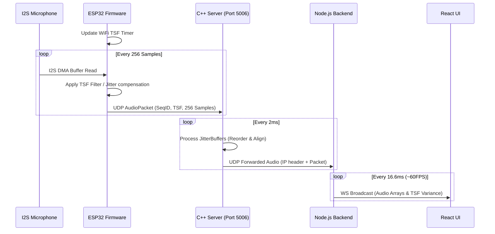

# Locustracer Architecture

This document outlines the architecture of the Locustracer system, detailing the interactions between the Firmware, C++ Server, and Node.js components.

## Overview
The system relies on a Master/Listener node topology:
- **Master Node (e.g. S2 Mini)**: Has Temperature/Humidity sensors, a Buzzer, and acts as the central timekeeper.
- **Listener Node (e.g. XIAO ESP32S3, DevKitC)**: Has I2S Microphones to capture audio.
- **Digital Twin Simulator (Optional)**: A containerized simulator using `pyroomacoustics` that simulates a 2x2m room. It mimics 4 microphones at the room corners and sends simulated UDP AudioPackets (with realistic ~200µs Wi-Fi TSF jitter to properly stress-test the `JitterBuffer`) using IP addresses `127.0.0.2` through `127.0.0.5` directly to the C++ Server on port `5006`. Additionally, it spins up a `TelemetrySimulator` background task that actively sends mocked environmental sensor telemetry (temperature, humidity, cpu_temp) to the Node.js backend's `POST /telemetry` endpoint at 5-second intervals, simulating real hardware nodes.

The data flow spans across:
1. **UDP Audio Path (High Frequency)**: Audio packets are sent from Listener nodes (or the Simulator) via UDP to the C++ Server, jitter-buffered, and forwarded to the Node.js backend.
2. **WebSocket Telemetry Flow (Low Frequency)**: ESP32 nodes connect directly to the Node.js backend to report telemetry and receive configuration/commands.

## Data Flow Diagram

```mermaid
flowchart TD
    %% Firmware Nodes
    subgraph Firmware["Firmware (ESP32)"]
        MasterNode["Master Node\n(SHTC3, Buzzer)"]
        ListenerNode["Listener Node\n(I2S Mic)"]
    end

    %% Simulator Container
    subgraph SimulatorContainer["Digital Twin Simulator"]
        PyRoomSimulator["pyroomacoustics\n(2x2m Room)"]
        TelemetrySim["TelemetrySimulator\n(Task)"]
    end

    %% C++ Server
    subgraph CPPServer["C++ System Server"]
        UDPServer["UDP Server\n(Port 5006)"]
        JitterBuffer["Jitter Buffer"]
    end

    %% Node.js Monitor App
    subgraph MonitorApp["Node.js Monitor App"]
        BackendUDP["Backend UDP Listener\n(Port 5008)"]
        BackendHTTP["Express REST & WebSocket\n(Port 8009)"]
    end

    %% UI
    ReactUI["React UI (Frontend)"]

    %% Audio Data Flow (UDP)
    ListenerNode -- "Audio UDP Packet\n(SeqID, TSF, Samples)" --> UDPServer
    PyRoomSimulator -- "Simulated UDP Packet\n(IPs: 127.0.0.2-127.0.0.5)\nwith ~200µs TSF Jitter" -.-> UDPServer
    UDPServer -- "Pushes Packets" --> JitterBuffer
    JitterBuffer -- "Forwarded Aligned Packets" --> BackendUDP
    BackendUDP -- "Streams Audio Arrays (~60FPS)\nFilters based on Active Twin" --> ReactUI

    %% Telemetry & Config Flow (WebSockets & REST)
    MasterNode -- "WS Telemetry (Temp/Hum)" --> BackendHTTP
    ListenerNode -- "WS Telemetry (CPU)" --> BackendHTTP
    TelemetrySim -- "REST POST /telemetry\n(127.0.0.2-127.0.0.5 every 5s)" -.-> BackendHTTP
    BackendHTTP -- "WS Config / Commands" --> MasterNode
    BackendHTTP -- "WS Config / Commands" --> ListenerNode
    
    BackendHTTP -- "WS State / Stats (~60FPS)" --> ReactUI
    ReactUI -- "UI Actions (Beep/Identify)" --> BackendHTTP
```

## UDP Audio Data Paths
1. The **Firmware Listener Nodes** capture audio at 48KHz using I2S and package 256 samples per packet. Alternatively, the **Digital Twin Simulator** generates simulated packets.
2. The packet (with a Sequence ID and filtered TSF time) is sent to the **C++ Server** on UDP port `5006`.
3. The **C++ Server** uses a `JitterBuffer` to reorder packets, mitigate network jitter, and drop delayed packets. It forwards aligned stream chunks to the Node.js Backend over `127.0.0.1:5008`.
4. The **Node.js UDP Listener** updates system statistics (drift, packet loss, bandwidth) and buffers the audio. It filters the broadcasted UDP streams based on whether the Digital Twin is active (ignoring physical hardware streams if active) and broadcasts these arrays at ~60FPS to the connected React UI clients over WebSockets.

## Telemetry Flow
- Every ESP32 node runs an `api_client` task that connects via WebSocket (`/ws`) to the Node.js backend.
- Nodes send JSON telemetry including `node_id`, `node_type`, `temperature`, `humidity`, and `cpu_temp` every 5 seconds.
- The Node.js backend sends down configurations (like `buzzer_volume` or commands like `buzzer_mode`).

## Sequence Diagram: TSF Sync and Audio Transmission



## 3D Room Visualization and Spatial Mapping

To enable accurate monitoring and intuitive debugging of real-time acoustic events, the frontend includes a high-fidelity visualizer that models the physical deployment environment.

### Key Components

- **Vaasa Wapice HQ (Alfa Room) Modeling**
  The visualizer represents the actual physical **Alfa Room** at Vaasa Wapice HQ, which has dimensions of **4.0m × 3.5m × 3.4m**.
  
- **High-Fidelity 3D Environment**
  Built using **React Three Fiber** and **Three.js**, the 3D environment features:
  - Exact scale-modeled boundaries (walls, floor, and ceiling).
  - Frosted glass windows and standard ceiling T-grids at **2.70m**.
  - Scale models of physical room furniture (such as a conference table and a chest of drawers) to maintain precise contextual reference.

- **Physical Boundary Node Mapping**
  Instead of utilizing abstract circular patterns, the listener and master nodes are mapped directly along the physical boundaries (walls) of the modeled room. This arrangement perfectly mirrors their actual deployment coordinates inside the physical lab.

- **Constrained Sound Source Localization**
  Dynamic, real-time localized sound source estimation is strictly constrained to the physical boundaries of the room. When a sound source is localized:
  - It casts dynamic 3D point lights in the environment.
  - Standard error and Time Difference of Arrival (TDOA) signal weight lines are dynamically rendered, linking the sound source directly to the active listening nodes.

- **Interactive UI Controls**
  Users can customize their view in real-time using simple dashboard toggles:
  - **Axes Indicators**: Show or hide 3D spatial coordinate axes helper (X, Y, Z).
  - **Floor Grids**: Toggle floor grid overlays for precise spatial estimation.
  - **Room Info**: Toggle context overlays showing physical room metrics and active system configurations.

