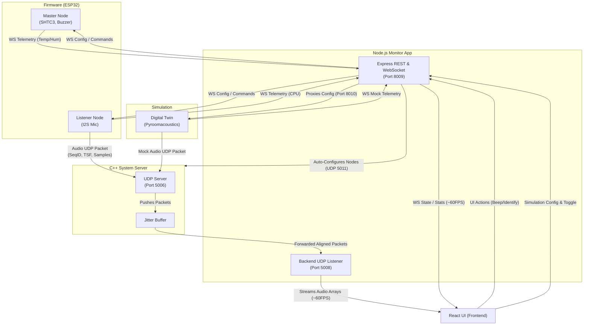

# Locustracer Architecture

This document outlines the architecture of the Locustracer system, detailing the interactions between the Firmware, C++ Server, and Node.js components.

## Overview
The system relies on a Master/Listener node topology, which can also be simulated via a Digital Twin:
- **Master Node (e.g. S2 Mini)**: Has Temperature/Humidity sensors, a Buzzer, and acts as the central timekeeper.
- **Listener Node (e.g. XIAO ESP32S3, DevKitC)**: Has I2S Microphones to capture audio.
- **Digital Twin (Native Python)**: A Pyroomacoustics simulation that acts as virtual listener nodes and acoustic environments.

The data flow spans across:
1. **UDP Audio Path (High Frequency)**: Audio packets are sent from Listener nodes via UDP to the C++ Server, jitter-buffered, and forwarded to the Node.js backend. The C++ UDP server (ports `5006`, `5011`) utilizes `SO_REUSEADDR` and `SO_REUSEPORT` for robust process restarts.
2. **WebSocket Telemetry Flow (Low Frequency)**: ESP32 nodes connect directly to the Node.js backend to report telemetry and receive configuration/commands.

## Data Flow Diagram



## UDP Audio Data Paths
1. The **Firmware Listener Nodes** (or the **Digital Twin Simulation**) capture audio at 48KHz using I2S (or simulate it) and package 256 samples per packet.
2. The packet (with a Sequence ID and filtered TSF time) is sent to the **C++ Server** on UDP port `5006`.
3. The **C++ Server** uses a `JitterBuffer` to reorder packets, mitigate network jitter, and drop delayed packets. It forwards aligned stream chunks to the Node.js Backend over `127.0.0.1:5008`.
4. The **Node.js UDP Listener** updates system statistics (drift, packet loss, bandwidth) and buffers the audio. It broadcasts these arrays at ~60FPS to the connected React UI clients over WebSockets.

## Telemetry Flow
- Every ESP32 node runs an `api_client` task that connects via WebSocket (`/ws`) to the Node.js backend. Similarly, the **Digital Twin** process establishes a WebSocket connection for its simulated nodes.
- Nodes send JSON telemetry including `node_id`, `node_type`, `temperature`, `humidity`, and `cpu_temp` every 5 seconds.
- The Node.js backend sends down configurations (like `buzzer_volume` or commands like `buzzer_mode`). The Digital Twin process also listens to toggles and updates over REST/WebSockets.

## Sequence Diagram: TSF Sync and Audio Transmission

```mermaid
sequenceDiagram
    participant Mic as I2S Microphone
    participant ESP as ESP32 Firmware
    participant Cpp as C++ Server (Port 5006)
    participant Node as Node.js Backend
    participant UI as React UI

    ESP->>ESP: Update WiFi TSF Timer
    loop Every 256 Samples
        Mic->>ESP: I2S DMA Buffer Read
        ESP->>ESP: Apply TSF Filter / Jitter compensation
        ESP->>Cpp: UDP AudioPacket (SeqID, TSF, 256 Samples)
    end
    
    loop Every 2ms
        Cpp->>Cpp: Process JitterBuffers (Reorder & Align)
        Cpp->>Node: UDP Forwarded Audio (IP header + Packet)
    end
    
    loop Every 16.6ms (~60FPS)
        Node->>UI: WS Broadcast (Audio Arrays & TSF Variance)
    end
    end
```

## C++ Backend TDOA Pipeline

The real-time sound source localization is achieved using a robust Time Difference of Arrival (TDOA) pipeline natively executed within the C++ Server. 

### Audio Synchronization and Jitter Buffer Routing
To prevent sample drift and ensure perfect time-alignment across streams, the TDOA pipeline is routed directly through the UDP Server's `JitterBuffer`. The incoming packets from either the physical hardware nodes or the Digital Twin are ingested via UDP, and the `AudioSynchronizer` applies a Phase-Locked Loop (PLL) to smooth out hardware TSF clock jitter. By buffering and perfectly aligning the 48kHz audio streams, the pipeline avoids cross-correlation drift.

### Localization Engine (GCC-PHAT & Gauss-Newton)
Once the multi-channel streams are aligned, the pipeline processes the data through two primary mathematical stages:
1. **GCC-PHAT Cross-Correlation**: The Generalized Cross-Correlation with Phase Transform (GCC-PHAT) is computed for each pair of microphones against a designated reference node. This calculates the precise time-delay (`tau`) between the arriving audio signals.
2. **Gauss-Newton Optimization**: The resulting delay measurements are passed into a non-linear `PositionSolver`. The solver utilizes Gauss-Newton optimization to iteratively minimize the error between the expected time delays (based on current position guesses) and the measured time delays. It continues iterating until it converges on the highly precise X, Y spatial coordinates of the sound source.

This pure mathematical approach successfully tracks dynamic acoustic events, such as transient acoustic "snaps", with high accuracy in real-time.

### C++ Server Logging
To prevent excessive terminal spam while running the continuous GCC-PHAT engine at ~60 FPS, the C++ server suppresses frame-by-frame debug output by default. It only logs the final `[Position] Estimated Location:` when a sound event triggers the localization engine.

If you are developing the tracking algorithm or need raw GCC-PHAT / TDOA matrices, you can enable verbose output by setting the `VERBOSE_LOGS=1` environment variable when running the system (e.g., within `docker-compose.yml`).

## Digital Twin Simulation

The system includes a Python-based Digital Twin built with Pyroomacoustics (`application/simulations/digital_twin_server.py`) that acts as a virtual drop-in replacement for the physical hardware nodes.

### Native Execution and Pre-start Cleanup
The simulation is natively executed via the `./locustracer.sh start` script. During boot:
- **Environment Management**: The script automatically checks for a Python virtual environment (`.venv`). If it is missing, it will create it and install all required dependencies from `application/simulations/requirements_sim.txt`.
- **Pre-start Cleanup**: To prevent port collisions and ensure a clean boot state, `locustracer.sh start` preemptively kills any dangling native processes (e.g., old instances of `cpp_server`, `vite`, and `digital_twin_server.py`) before booting the services.

### Simulation Physics and Specifications
- **Simulated Environment**: Models a room precisely sized at **4.0m x 3.5m**.
- **Sample Rate**: The simulation engine operates at **48,000Hz**, perfectly matching the ESP32 hardware I2S capture frequency for seamless C++ server compatibility.
- **Sensor Noise Modeling**: A **-40dB** white noise floor is continuously injected into the virtual microphones to accurately simulate the characteristics of physical MEMS sensors.
- **Clock Drift Emulation**: To simulate independent hardware clock inaccuracies, the simulation injects **±200µs** of independent random jitter into the TSF timestamps for each virtual node.
- **Transient Snapping Mode**: By default, the simulation operates in a "Transient Snapping" mode. It randomly teleports the virtual sound source within the room and plays a highly realistic acoustic "snap" (a short burst of exponentially decaying pink noise) every 1 to 3 seconds. This replaces the legacy continuous orbital movement mode.

### Dynamic Control and Auto-Configuration
- **Dynamic Configuration**: The React frontend provides a **Simulation Config** pane with auto-saving sliders to dynamically adjust parameters like `gain` and `noise_amplitude` (legacy parameters `source_speed` and `source_radius` remain in the payload but are inactive). The Node.js Express server proxies these API calls directly to the Python Digital Twin on port `8010`.
- **Auto-Configuration**: When the simulation is activated via the UI, the Node.js backend automatically overrides the active physical node mapping. It populates `POST /nodes/config` with the simulation IPs (`127.0.0.2` - `127.0.0.5`), mapping them to the corners of the 4.0m x 3.5m simulated room. This layout is immediately forwarded to the C++ server via UDP port `5011`.

## 3D Room Visualization and Spatial Mapping

To enable accurate monitoring and intuitive debugging of real-time acoustic events, the frontend includes a high-fidelity visualizer that models the physical deployment environment.

### Key Components

- **Vaasa Wapice HQ (Alfa Room) Modeling**
  The visualizer represents the actual physical **Alfa Room** at Vaasa Wapice HQ, which has dimensions of **4.0m × 3.5m × 3.4m**.
  
- **High-Fidelity 3D Environment**
  Built using **React Three Fiber** and **Three.js**, the 3D environment features:
  - Exact scale-modeled boundaries (walls, floor, and ceiling).
  - Frosted glass windows and standard ceiling T-grids at **2.70m**.
  - Scale models of physical room furniture (such as a conference table and a chest of drawers) to maintain precise contextual reference.

- **Physical Boundary Node Mapping**
  Instead of utilizing abstract circular patterns, the listener and master nodes are mapped directly along the physical boundaries (walls) of the modeled room. This arrangement perfectly mirrors their actual deployment coordinates inside the physical lab.

- **Constrained Sound Source Localization**
  Dynamic, real-time localized sound source estimation is strictly constrained to the physical boundaries of the room. When a sound source is localized:
  - It casts dynamic 3D point lights in the environment.
  - Standard error and Time Difference of Arrival (TDOA) signal weight lines are dynamically rendered, linking the sound source directly to the active listening nodes.

- **Hardware Identification & Selection**
  When a node is selected in the Node Position Editor, it visually pulses white in the 3D map. Simultaneously, the frontend repeatedly sends `identify` WebSocket commands to the backend, causing the corresponding physical node's onboard LED to actively blink. This seamlessly bridges the virtual and physical environments to assist with hardware setup.

- **Interactive UI Controls**
  Users can customize their view in real-time using simple dashboard toggles:
  - **TDOA Engine Toggle**: Switches the visualizer's localization logic between the highly accurate backend **C++ GCC-PHAT** algorithm and the lightweight **Frontend RMS** estimation engine.
  - **Axes Indicators**: Show or hide 3D spatial coordinate axes helper (X, Y, Z).
  - **Floor Grids**: Toggle floor grid overlays for precise spatial estimation.
  - **Room Info**: Toggle context overlays showing physical room metrics and active system configurations.

